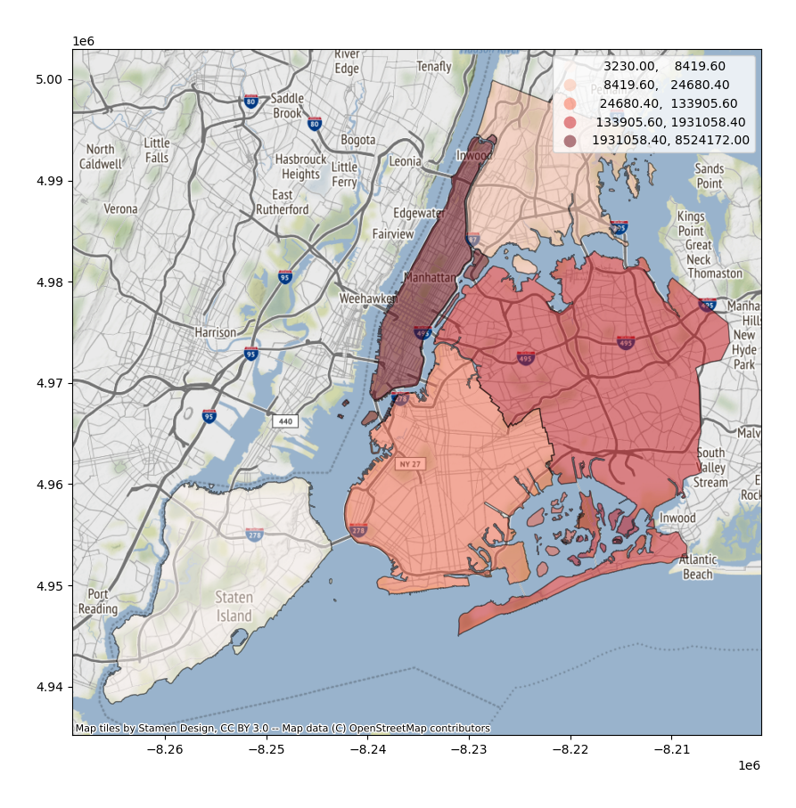
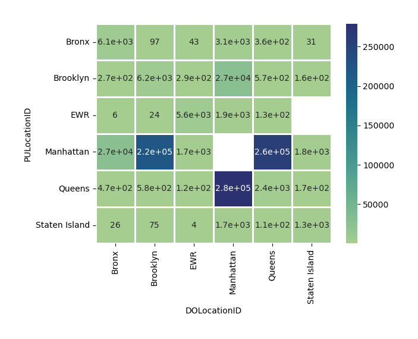

# NYc Yellow Taxi Analytics
 

From data collected by NYC about taxi trips, we'll extract some useful analytics about the average cost of trips through several districts in the city of NY.

This project is developed by:
- Vincenzo Maria Calandra
- Eleonora Papa

under the supervision of Professor Guarrasi Valerio.

## What process generates this data?
The data used in the attached datasets were collected and provided to the NYC Taxi and Limousine Commission (TLC) by technology providers authorized under the Taxicab & Livery Passenger Enhancement Programs (TPEP/LPEP).

You can find the data set at this [link](https://www.nyc.gov/site/tlc/about/tlc-trip-record-data.page) 

## When was it created?
On a first analysis we are going to examinate data collects on January 2022, you can find the data set [here](https://d37ci6vzurychx.cloudfront.net/trip-data/yellow_tripdata_2020-01.parquet)

## Schema description
| Field Name            | Description                                                                                                                                                                                                                                          |
| --------------------- | ---------------------------------------------------------------------------------------------------------------------------------------------------------------------------------------------------------------------------------------------------- |
| VendorID              | A code indicating the TPEP provider that provided the record.  1= Creative Mobile Technologies, LLC;  2= VeriFone Inc                                                                                                                                |
| tpep_pickup_datetime  | The date and time when the meter was engaged.                                                                                                                                                                                                        |
| tpep_dropoff_datetime | The date and time when the meter was disengaged.                                                                                                                                                                                                     |
| Passenger_count       | The number of passengers in the vehicle.                                                                                                                                                                                                             |
| Trip_distance         | The elapsed trip distance in miles reported by the taximeter.                                                                                                                                                                                        |
| PULocationID          | TLC Taxi Zone in which the taximeter was engaged                                                                                                                                                                                                     |
| DOLocationID          | TLC Taxi Zone in which the taximeter was disengaged                                                                                                                                                                                                  |
| RateCodeID            | The final rate code in effect at the end of the trip.  1= Standard rate 2=JFK 3=Newark 4=Nassau or Westchester 5=Negotiated fare 6=Group ride                                                                                                        |
| Store_and_fwd_flag    | This flag indicates whether the trip record was held in vehicle memory before sending to the vendor, aka “store and forward,” because the vehicle did not have a connection to the server. Y= store and forward trip N= not a store and forward trip |
| Payment_type          | A numeric code signifying how the passenger paid for the trip. 1= Credit card 2= Cash 3= No charge 4= Dispute 5= Unknown 6= Voided trip                                                                                                              |
| Fare_amount           | The time-and-distance fare calculated by the meter.                                                                                                                                                                                                  |
| Extra                 | Miscellaneous extras and surcharges. Currently, this only includes the $0.50 and $1 rush hour and overnight charges.                                                                                                                                 |
| MTA_tax               | $0.50 MTA tax that is automatically triggered based on the metered rate in use.                                                                                                                                                                      |
| Improvement_surcharge | $0.30 improvement surcharge assessed trips at the flag drop. The improvement surcharge began being levied in 2015.                                                                                                                                   |
| Tip_amount            | Tip amount – This field is automatically populated for credit card tips. Cash tips are not included.                                                                                                                                                 |
| Tolls_amount          | Total amount of all tolls paid in trip.                                                                                                                                                                                                              |
| Total_amount          | The total amount charged to passengers. Does not include cash tips.                                                                                                                                                                                  |
| Congestion_Surcharge  | Total amount collected in trip for NYS congestion surcharge.                                                                                                                                                                                         |
| Airport_fee           | $1.25 for pick up only at LaGuardia and John F. Kennedy Airports                                                                                                                                                                                     |

## Data values
The initial data set has 6405008 rows and 19 colums.

| Field Name            | Type           | Range of values                 |
| --------------------- | -------------- | ------------------------------- |
| VendorID              | int64          | [1,2]                           |
| tpep_pickup_datetime  | datetime64[ns] | ["2020-01-01",...,"2020-12-31"] |
| tpep_dropoff_datetime | datetime64[ns] | ["2020-01-01",...,"2020-12-31"] |
| Passenger_count       | float64        | [0,...,9]                       |
| Trip_distance         | float64        | [0,..,210240.07]                |
| PULocationID          | float64        | [0,..,256]                      |
| DOLocationID          | object         | [0,..,256]                      |
| RateCodeID            | int64          | [1..6]                          |
| Store_and_fwd_flag    | int64          | [Y,N]                           |
| Payment_type          | int64          | [1..6]                          |
| Fare_amount           | float64        | [-1238.0,..,4265.0]             |
| Extra                 | float64        | [-27.0,..,113.01]               |
| MTA_tax               | float64        | [-0.5,...,30.8]                 |
| Improvement_surcharge | float64        | [-0.3,0.3]                      |
| Tip_amount            | float64        | [-91.0,...,1100.0]              |
| Tolls_amount          | float64        | [-35.74,...,910.5]              |
| total_amount          | float64        | [-1242.3,...,4268.3]            |
| Congestion_Surcharge  | float64        | [-2.5,...,2.75]                 |
| Airport_fee           | object         | Nan                             |

The following graph highlights the NaN values in the schema:
 

## Connected schema
This schema reports the details of each borough. 

| Field name   | Description                             | Range of values                                                                                                                                                                                                                                                                                                                                                                                                                                                                                                                                                                                                                                                                                                                                                                                                                                                                                                                                                                                                                                                                                                                                                                                                                                                                                                                                                                                                                                                                                                                                                                                                                                                                                                                                                                                                                                                                                                                                                                                                                                                                                                                                                                                                                                                                                                                                                                                                                                                                                                                                                                                                                                                                                                                                                                                                                                                                                                                                                                                                                                                                                                                                                                                                                                                                                                                                                                                                                                                                                                                                                                                                                                                                                                                                                                                                                                                                                                                                                                                                                                                                                                                                                                                                                                                                                                                                                                                                                                                                                                                                                                                                                                                                                                                                                                                                                                                                                                                                                                                                                                                                                                                                                                                                                                                                                                                                                                                                                                                                                                                                                                                                                                                                                                                                                                                                                                                                                                                                                                                       | cardinality | Kind   |
| ------------ | --------------------------------------- | ----------------------------------------------------------------------------------------------------------------------------------------------------------------------------------------------------------------------------------------------------------------------------------------------------------------------------------------------------------------------------------------------------------------------------------------------------------------------------------------------------------------------------------------------------------------------------------------------------------------------------------------------------------------------------------------------------------------------------------------------------------------------------------------------------------------------------------------------------------------------------------------------------------------------------------------------------------------------------------------------------------------------------------------------------------------------------------------------------------------------------------------------------------------------------------------------------------------------------------------------------------------------------------------------------------------------------------------------------------------------------------------------------------------------------------------------------------------------------------------------------------------------------------------------------------------------------------------------------------------------------------------------------------------------------------------------------------------------------------------------------------------------------------------------------------------------------------------------------------------------------------------------------------------------------------------------------------------------------------------------------------------------------------------------------------------------------------------------------------------------------------------------------------------------------------------------------------------------------------------------------------------------------------------------------------------------------------------------------------------------------------------------------------------------------------------------------------------------------------------------------------------------------------------------------------------------------------------------------------------------------------------------------------------------------------------------------------------------------------------------------------------------------------------------------------------------------------------------------------------------------------------------------------------------------------------------------------------------------------------------------------------------------------------------------------------------------------------------------------------------------------------------------------------------------------------------------------------------------------------------------------------------------------------------------------------------------------------------------------------------------------------------------------------------------------------------------------------------------------------------------------------------------------------------------------------------------------------------------------------------------------------------------------------------------------------------------------------------------------------------------------------------------------------------------------------------------------------------------------------------------------------------------------------------------------------------------------------------------------------------------------------------------------------------------------------------------------------------------------------------------------------------------------------------------------------------------------------------------------------------------------------------------------------------------------------------------------------------------------------------------------------------------------------------------------------------------------------------------------------------------------------------------------------------------------------------------------------------------------------------------------------------------------------------------------------------------------------------------------------------------------------------------------------------------------------------------------------------------------------------------------------------------------------------------------------------------------------------------------------------------------------------------------------------------------------------------------------------------------------------------------------------------------------------------------------------------------------------------------------------------------------------------------------------------------------------------------------------------------------------------------------------------------------------------------------------------------------------------------------------------------------------------------------------------------------------------------------------------------------------------------------------------------------------------------------------------------------------------------------------------------------------------------------------------------------------------------------------------------------------------------------------------------------------------------------------------------------------------------------------------- | ----------- | ------ |
| LocationID   | The numeric identifier of the location. | [1..265]                                                                                                                                                                                                                                                                                                                                                                                                                                                                                                                                                                                                                                                                                                                                                                                                                                                                                                                                                                                                                                                                                                                                                                                                                                                                                                                                                                                                                                                                                                                                                                                                                                                                                                                                                                                                                                                                                                                                                                                                                                                                                                                                                                                                                                                                                                                                                                                                                                                                                                                                                                                                                                                                                                                                                                                                                                                                                                                                                                                                                                                                                                                                                                                                                                                                                                                                                                                                                                                                                                                                                                                                                                                                                                                                                                                                                                                                                                                                                                                                                                                                                                                                                                                                                                                                                                                                                                                                                                                                                                                                                                                                                                                                                                                                                                                                                                                                                                                                                                                                                                                                                                                                                                                                                                                                                                                                                                                                                                                                                                                                                                                                                                                                                                                                                                                                                                                                                                                                                                                              | 265         | int64  |
| Borough      | The name of the borough.                | ['EWR', 'Queens', 'Bronx', 'Manhattan', 'Staten Island', 'Brooklyn',         'Unknown']                                                                                                                                                                                                                                                                                                                                                                                                                                                                                                                                                                                                                                                                                                                                                                                                                                                                                                                                                                                                                                                                                                                                                                                                                                                                                                                                                                                                                                                                                                                                                                                                                                                                                                                                                                                                                                                                                                                                                                                                                                                                                                                                                                                                                                                                                                                                                                                                                                                                                                                                                                                                                                                                                                                                                                                                                                                                                                                                                                                                                                                                                                                                                                                                                                                                                                                                                                                                                                                                                                                                                                                                                                                                                                                                                                                                                                                                                                                                                                                                                                                                                                                                                                                                                                                                                                                                                                                                                                                                                                                                                                                                                                                                                                                                                                                                                                                                                                                                                                                                                                                                                                                                                                                                                                                                                                                                                                                                                                                                                                                                                                                                                                                                                                                                                                                                                                                                                                               | 7           | object |
| Zone         | The name of the zone.                   | ['Newark Airport', 'Jamaica Bay', 'Allerton/Pelham Gardens',        'Alphabet City', 'Arden Heights', 'Arrochar/Fort Wadsworth',        'Astoria', 'Astoria Park', 'Auburndale', 'Baisley Park',        'Bath Beach', 'Battery Park', 'Battery Park City', 'Bay Ridge',        'Bay Terrace/Fort Totten', 'Bayside', 'Bedford', 'Bedford Park',        'Bellerose', 'Belmont', 'Bensonhurst East', 'Bensonhurst West',        'Bloomfield/Emerson Hill', 'Bloomingdale', 'Boerum Hill',        'Borough Park', 'Breezy Point/Fort Tilden/Riis Beach',        'Briarwood/Jamaica Hills', 'Brighton Beach', 'Broad Channel',        'Bronx Park', 'Bronxdale', 'Brooklyn Heights',        'Brooklyn Navy Yard', 'Brownsville', 'Bushwick North',        'Bushwick South', 'Cambria Heights', 'Canarsie', 'Carroll Gardens',        'Central Harlem', 'Central Harlem North', 'Central Park',        'Charleston/Tottenville', 'Chinatown', 'City Island',        'Claremont/Bathgate', 'Clinton East', 'Clinton Hill',        'Clinton West', 'Co-Op City', 'Cobble Hill', 'College Point',        'Columbia Street', 'Coney Island', 'Corona', 'Country Club',        'Crotona Park', 'Crotona Park East', 'Crown Heights North',        'Crown Heights South', 'Cypress Hills', 'Douglaston',        'Downtown Brooklyn/MetroTech', 'DUMBO/Vinegar Hill',        'Dyker Heights', 'East Chelsea',        'East Concourse/Concourse Village', 'East Elmhurst',        'East Flatbush/Farragut', 'East Flatbush/Remsen Village',        'East Flushing', 'East Harlem North', 'East Harlem South',        'East New York', 'East New York/Pennsylvania Avenue',        'East Tremont', 'East Village', 'East Williamsburg', 'Eastchester',        'Elmhurst', 'Elmhurst/Maspeth',        "Eltingville/Annadale/Prince's Bay", 'Erasmus', 'Far Rockaway',        'Financial District North', 'Financial District South',        'Flatbush/Ditmas Park', 'Flatiron', 'Flatlands', 'Flushing',        'Flushing Meadows-Corona Park', 'Fordham South', 'Forest Hills',        'Forest Park/Highland Park', 'Fort Greene', 'Fresh Meadows',        'Freshkills Park', 'Garment District', 'Glen Oaks', 'Glendale',        "Governor's Island/Ellis Island/Liberty Island", 'Gowanus',        'Gramercy', 'Gravesend', 'Great Kills', 'Great Kills Park',        'Green-Wood Cemetery', 'Greenpoint', 'Greenwich Village North',        'Greenwich Village South', 'Grymes Hill/Clifton',        'Hamilton Heights', 'Hammels/Arverne',        'Heartland Village/Todt Hill', 'Highbridge', 'Highbridge Park',        'Hillcrest/Pomonok', 'Hollis', 'Homecrest', 'Howard Beach',        'Hudson Sq', 'Hunts Point', 'Inwood', 'Inwood Hill Park',        'Jackson Heights', 'Jamaica', 'Jamaica Estates', 'JFK Airport',        'Kensington', 'Kew Gardens', 'Kew Gardens Hills',        'Kingsbridge Heights', 'Kips Bay', 'LaGuardia Airport',        'Laurelton', 'Lenox Hill East', 'Lenox Hill West',        'Lincoln Square East', 'Lincoln Square West',        'Little Italy/NoLiTa', 'Long Island City/Hunters Point',        'Long Island City/Queens Plaza', 'Longwood', 'Lower East Side',        'Madison', 'Manhattan Beach', 'Manhattan Valley', 'Manhattanville',        'Marble Hill', 'Marine Park/Floyd Bennett Field',        'Marine Park/Mill Basin', 'Mariners Harbor', 'Maspeth',        'Meatpacking/West Village West', 'Melrose South', 'Middle Village',        'Midtown Center', 'Midtown East', 'Midtown North', 'Midtown South',        'Midwood', 'Morningside Heights', 'Morrisania/Melrose',        'Mott Haven/Port Morris', 'Mount Hope', 'Murray Hill',        'Murray Hill-Queens', 'New Dorp/Midland Beach', 'North Corona',        'Norwood', 'Oakland Gardens', 'Oakwood', 'Ocean Hill',        'Ocean Parkway South', 'Old Astoria', 'Ozone Park', 'Park Slope',        'Parkchester', 'Pelham Bay', 'Pelham Bay Park', 'Pelham Parkway',        'Penn Station/Madison Sq West', 'Port Richmond',        'Prospect-Lefferts Gardens', 'Prospect Heights', 'Prospect Park',        'Queens Village', 'Queensboro Hill', 'Queensbridge/Ravenswood',        'Randalls Island', 'Red Hook', 'Rego Park', 'Richmond Hill',        'Ridgewood', 'Rikers Island',        'Riverdale/North Riverdale/Fieldston', 'Rockaway Park',        'Roosevelt Island', 'Rosedale', 'Rossville/Woodrow',        'Saint Albans', 'Saint George/New Brighton',        'Saint Michaels Cemetery/Woodside', 'Schuylerville/Edgewater Park',        'Seaport', 'Sheepshead Bay', 'SoHo', 'Soundview/Bruckner',        'Soundview/Castle Hill', 'South Beach/Dongan Hills',        'South Jamaica', 'South Ozone Park', 'South Williamsburg',        'Springfield Gardens North', 'Springfield Gardens South',        'Spuyten Duyvil/Kingsbridge', 'Stapleton', 'Starrett City',        'Steinway', 'Stuy Town/Peter Cooper Village', 'Stuyvesant Heights',        'Sunnyside', 'Sunset Park East', 'Sunset Park West',        'Sutton Place/Turtle Bay North', 'Times Sq/Theatre District',        'TriBeCa/Civic Center', 'Two Bridges/Seward Park',        'UN/Turtle Bay South', 'Union Sq',        'University Heights/Morris Heights', 'Upper East Side North',        'Upper East Side South', 'Upper West Side North',        'Upper West Side South', 'Van Cortlandt Park',        'Van Cortlandt Village', 'Van Nest/Morris Park',        'Washington Heights North', 'Washington Heights South',        'West Brighton', 'West Chelsea/Hudson Yards', 'West Concourse',        'West Farms/Bronx River', 'West Village',        'Westchester Village/Unionport', 'Westerleigh', 'Whitestone',        'Willets Point', 'Williamsbridge/Olinville',        'Williamsburg (North Side)', 'Williamsburg (South Side)',        'Windsor Terrace', 'Woodhaven', 'Woodlawn/Wakefield', 'Woodside',        'World Trade Center', 'Yorkville East', 'Yorkville West', 'NV',        nan] | 264         | object |
| service_zone | The service zone name.                  | ['EWR', 'Boro Zone', 'Yellow Zone', 'Airports', nan]                                                                                                                                                                                                                                                                                                                                                                                                                                                                                                                                                                                                                                                                                                                                                                                                                                                                                                                                                                                                                                                                                                                                                                                                                                                                                                                                                                                                                                                                                                                                                                                                                                                                                                                                                                                                                                                                                                                                                                                                                                                                                                                                                                                                                                                                                                                                                                                                                                                                                                                                                                                                                                                                                                                                                                                                                                                                                                                                                                                                                                                                                                                                                                                                                                                                                                                                                                                                                                                                                                                                                                                                                                                                                                                                                                                                                                                                                                                                                                                                                                                                                                                                                                                                                                                                                                                                                                                                                                                                                                                                                                                                                                                                                                                                                                                                                                                                                                                                                                                                                                                                                                                                                                                                                                                                                                                                                                                                                                                                                                                                                                                                                                                                                                                                                                                                                                                                                                                                                  | 5           | object |

## Research
Beginning in March 2020, New York City faced an unprecedented public health crisis as most of the City's economy paused to slow the spread of COVID-19. This report summarizes the effects of the COVID-19 pause on TLC-regulated industries from March 15 – June 30, 2020, as most passengers stayed home. The report also describes the measures TLC took to help including utilizing drivers as part of the City food relief program and also connect drivers with other available government support.

Due to COVID-19 and its impact on the daily operations of small businesses, TLC granted smaller bases an extension on trip record submissions. This report only includes trip and trip-related data from Yellow Taxi, Street-Hail Livery and High Volume For-Hire Services.

# Definitive Schema description

| Field Name            | Description                                                                                                                             |
| --------------------- | --------------------------------------------------------------------------------------------------------------------------------------- |
| tpep_pickup_datetime  | The date and time when the meter was engaged.                                                                                           |
| tpep_dropoff_datetime | The date and time when the meter was disengaged.                                                                                        |
| Passenger_count       | The number of passengers in the vehicle.                                                                                                |
| Trip_distance         | The elapsed trip distance in miles reported by the taximeter.                                                                           |
| PULocationID          | TCL Taxi Zone in which the taximeter was engaged.                                                                                       |
| DOLocationID          | TLC Taxi Zone in which the taximeter was disengaged.                                                                                    |
| Payment_type          | A numeric code signifying how the passenger paid for the trip. 1=Credit card, 2=Cash, 3=No charge, 4=Dispute, 5=Unknown, 6=Voided trip. |
| Fare_amount           | The time-and-distance fare calculated by the meter.                                                                                     |
| Congestion_Surcharge  | Total amount collected in trip for NYS congestion surcharge.                                                                            |

## Missing Valus or not valid values and data tidy or duplicated field analysis
| Field Name           | Invalid Values  | Null Values |
| -------------------- | --------------- | ----------- |
| Passenger_count      | 0               | True        |
| Trip_distance        | 0               | False       |
| PULocationID         | NV, Unknow      | True        |
| DOLocationID         | NV, Unknow      | True        |
| Fare_amount          | Negative amount | False       |
| Congestion_Surcharge | Negative amount | True        |

For each invalid or NaN or untidy field we are going to proceed as follow:
- If passenger_count is 0 or NaN the row will be deleted.
- If trip_distance equal 0 and tpep_dropoff_datetime-tpep_pickup_datetime is minor than 600s the row will be removed else we will substitude the trip_distance with the average trip distance between the borough.
- If PULocation or DOLocation is NaN or NV or Unknown we are going to choose two district with similar average path or a trip with similar duration.
- If the fare_amount is negative the row will be deleted.
- If the congestion_surcharge is negative the row will be deleted. 

Also we found 12949 duplicated rows that was deleted.

## Data Boxplot
 

## Data Bar Chart
 

## Data Bar Plot
 

## Data Heat Map
 

 

## Data Scatter Plot
 

